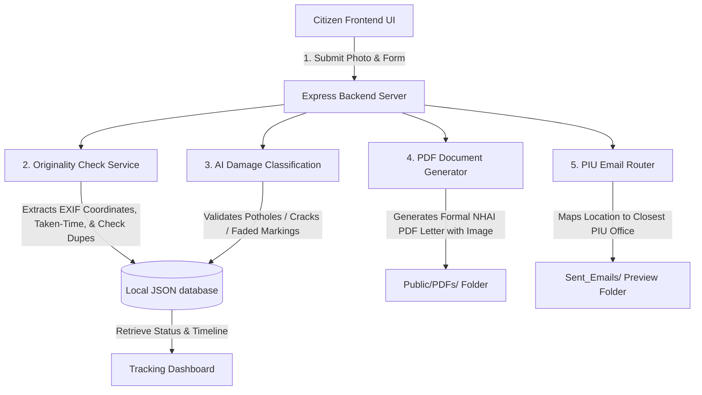

# NHAI Citizen Safety & Road Defect Management Portal

An automated, full-stack platform designed to collect road defect complaints, run integrity & originality validations, classify pavement damage via computer vision, generate official complaint letters, and route notifications to regional NHAI Project Implementation Units (PIU).

---

## 🏗️ System Architecture & Workflow



---

## 👥 Team Roles & Integration Blueprint

This codebase acts as the central integration base for our project. Here is how our team's deliverables map to the codebase:

### 1. Jesika (Completed & Fully Operational)
* **Intake Interface**: HTML5 Drag-and-drop form with Leaflet map pinpointing.
* **Originality Audit Engine**: Validates image EXIF geotags, checks timestamp differences, audits editing software traces, and scans image SHA-256/pixel fingerprints to reject duplicate uploads.
* **Model Integration Module**: Serves classifications and coordinates.
* **Complaint Letter PDF Compiler**: Generates formatted A4 PDF letters with official headers, metadata metrics, and embedded image evidence.
* **PIU Email Router**: Calculates geodesic distances using the Haversine formula to map coordinates to regional PIU offices (Delhi, Mumbai, Varanasi, Bangalore, Chennai, Guwahati, Kolkata) and logs dispatch files.
* **Tracking System**: A step-by-step workflow tracking timeline.

### 2. Hemhalatha (Integration Hooks Prepared)
* **Model Training Integration**: Hook points are created inside `services/modelService.js`. When your road defect trained model is ready, toggle `USE_REAL_MODEL_API` to `true` to direct image streams to your classification API.
* **Heatmap Generation**: All coordinates, timestamps, and categories are saved inside `data/complaints.json`. You can read this database file on your heatmap UI and plot coordinates onto Leaflet/Google maps.
* **Multilingual UI Support**: CSS and layout tags are fully structured to easily map translation JSON elements on the frontend.

### 3. Meenakshi (Integration Hooks Prepared)
* **AI Chatbot with RAG**: Chat UI placeholders and Express backend server handles are structured. You can mount your chatbot endpoint inside `server.js` and serve it through the frontend UI.
* **Country Onboarding Framework**: Data onboarding APIs can read and push records through `POST /api/complaints` and `GET /api/complaints`.

---

## ⚙️ Installation & Running the Application

Ensure you have [Node.js](https://nodejs.org/) installed, then follow these steps:

### 1. Initialize Dependencies
Open your terminal in the project directory and run:
```bash
npm install
```
This installs the required packages: `express`, `multer` (file handling), `exifreader` (metadata parsing), `pdfkit` (PDF rendering), `nodemailer` (email routing), and `uuid` (unique ID generation).

### 2. Run the Server
Start the local server process:
```bash
npm start
```
The server will start up and output:
`NHAI Safety Portal backend running on http://localhost:3000`

### 3. Open in Browser
Open your browser and visit:
```
http://localhost:3000
```

---

## 🛠️ Code Structure & Developer Guide

```
Road safety 1/
│
├── server.js               # Main Express app, middleware, and api routes
├── package.json            # Node dependency configurations
├── .gitignore              # Excludes development folders, uploads, PDFs, and email drafts
│
├── services/               # Jesika's Backend Business Logic
│   ├── metadataService.js  # EXIF parsing, gps validation, distance maths, & duplicate hashing
│   ├── modelService.js     # Road classification engine (pluggable API model bridge)
│   ├── pdfService.js       # Assembles the NHAI official letter PDF documents
│   └── emailService.js     # Resolves closest PIU emails and writes dispatch previews
│
├── data/
│   └── complaints.json     # Local database record storing all filed incidents
│
├── sent_emails/            # Preview drafts of sent email logs (Open HTML files in browser)
│
└── public/                 # Citizen Dashboard Frontend UI
    ├── index.html          # Web page structural sections (Tabs, Form, Stepper Tracker)
    ├── css/style.css       # Premium glassmorphic custom theme
    ├── js/app.js           # Extracts client EXIF, updates Leaflet maps, & runs API fetches
    ├── uploads/            # Holds citizen evidence photographs
    └── pdfs/               # Holds compiled NHAI complaint PDF documents
```

---

## 🔍 How to Test the Portals Features

1. **Verify GPS Pinning (Real Photo)**:
   * Select a picture taken on a smartphone with location services enabled.
   * The Leaflet map on the right will instantly pin the photo's exact capture location.
   * Submit the complaint. The AI laser line will scan, file the issue, generate a PDF, map the closest PIU office, and write a mock dispatch email.

2. **Verify Fake Detection (Downloaded Picture / Screenshot)**:
   * Select a downloaded image from Google or a screenshot (EXIF headers are stripped/missing).
   * The system will flag a `Warning: Missing GPS` badge and lock the map.
   * If submitted, the portal marks the status as `Flagged for Review` (Quarantined) and blocks it from routing emails to PIU offices.

3. **Verify Spoof Detection (Edited Photo)**:
   * Upload an image edited in Photoshop or Lightroom.
   * The system flags the editing software used in the metadata list, drops the Originality Score, and flags it as suspicious.

4. **Verify Duplicate Prevention**:
   * Attempt to upload the exact same image twice.
   * The backend rejects the second upload instantly, notifying the citizen of a duplicate submission.

5. **Review Outputs**:
   * Inspect the formatted PDF letters inside `public/pdfs/`.
   * Open the mock HTML email dispatches in the `sent_emails/` folder to review what details route to the Project Directors.
